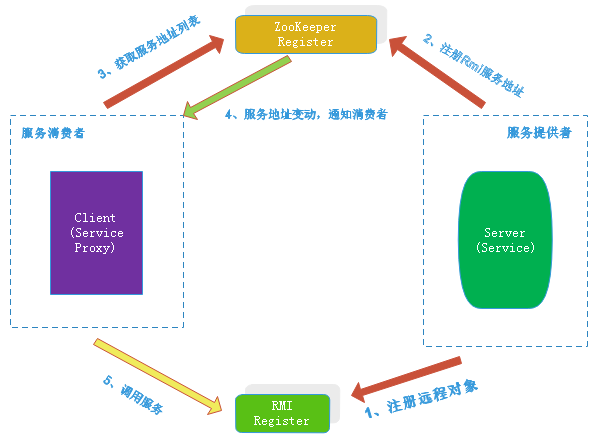

# likab-rmi用户指南
## 一、likab-rmi介绍
> * [likab-rmi设计及相关技术](http://blog.csdn.net/rtuujnncc/article/details/74007824)

> * likab-rmi架构图

## 二、Maven依赖
	<dependency>
		<groupId>org.likabframework</groupId>
		<artifactId>likab-rmi</artifactId>
		<version>1.0.0</version>
	</dependency>

## 三、likab-rmi在Spring中的用法

#### 1. XML配置
##### 1.1. 服务端

    <!-- 本地服务 -->				
	<bean id="helloService" class="org.likabframework.example.service.HelloServiceImpl"/>
	
	<!-- 发布rmi服务 -->
	<bean class="org.likabframework.rmi.support.RmiServiceExporter">
		<property name="service" ref="helloService"/>
		<property name="zkAddress" value="192.168.233.130:2181"/>
		<property name="serviceInterface" value="org.likabframework.example.service.IHelloService"/>
		<property name="serviceName" value="HelloService"/>
	</bean>

##### 1.2. 客户端

    <!-- 引用rmi服务 -->
	<bean id="helloService" class="org.likabframework.rmi.support.RmiProxyFactoryBean">
		<property name="loadBalance" value="consumerHash"/>
		<property name="zkAddress" value="192.168.233.130:2181"/>
		<property name="serviceInterface" value="org.likabframework.example.service.IHelloService"/>
		<property name="serviceName" value="HelloService"/>
	</bean>
	
------
#### 2. Java配置
##### 2.1. 服务端

    @Bean
	public RmiServiceExporter exporter() {
		RmiServiceExporter exporter = new RmiServiceExporter();
		IHelloService helloService = new HelloServiceImpl();
		exporter.setService(helloService);
		exporter.setZkAddress("192.168.233.130:2181");
		exporter.setServiceInterface(IHelloService.class);
		exporter.setServiceName("HelloService");
        return exporter;
	}
	
##### 2.2. 客户端

    
    @Bean
	public RmiProxyFactoryBean factory() {
		RmiProxyFactoryBean factory = new RmiProxyFactoryBean();
		factory.setLoadBalance(LoadBalance.CONSUMER_HASH_LOADBALANCE);
		factory.setServiceName("HelloService");
		factory.setServiceInterface(IHelloService.class);
		factory.setZkAddress("192.168.233.130:2181");
	    return factory;
	}
	
	@Bean
	public IHelloService helloService() {
		RmiProxyFactoryBean factory = factory();
		return (IHelloService) factory.getObject();
	}

------
#### 3. rmi服务端和客户端示例代码
> * [likab-rmi-example](https://github.com/xiapshen/likab-framework/tree/master/examples/likab-rmi-example)
